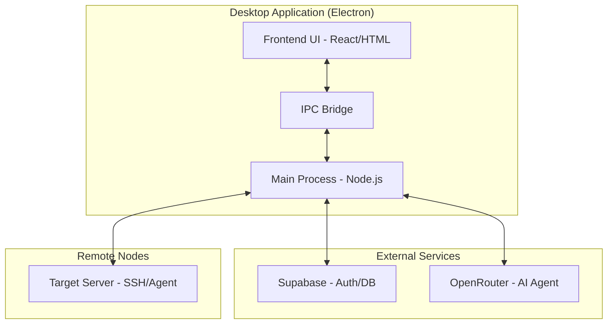
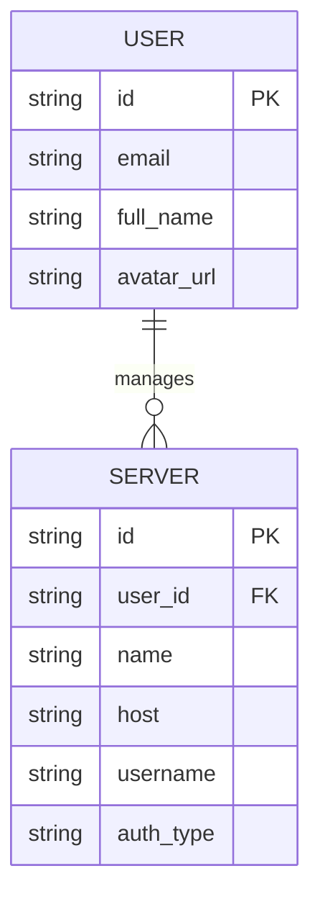
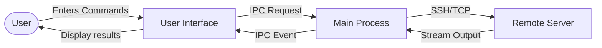
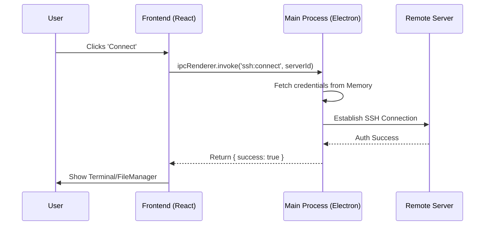

# Devyntra Desktop Architecture & Diagrams

This document provides a simple overview of the Devyntra desktop software architecture through four key diagrams: Architecture, ER, DFD, and Sequence.

## 1. System Architecture
The system follows a dual-process architecture for security and performance.

## 2. Entity Relationship (ER) Diagram
The core data structure focusing on servers and users.

## 3. Data Flow Diagram (DFD)
How data moves from the user interface to remote servers.

## 4. Sequence Diagram
The flow of connecting to a remote server.

## Simple Steps to Understand
1. **Frontend (React)**: What you see and interact with.
2. **Main Process (Node.js)**: The brain that handles security and connections.
3. **IPC Bridge**: The secure tunnel between the view and the brain.
4. **Remote Connection**: Securely managing your servers via SSH or the Devyntra Agent.
